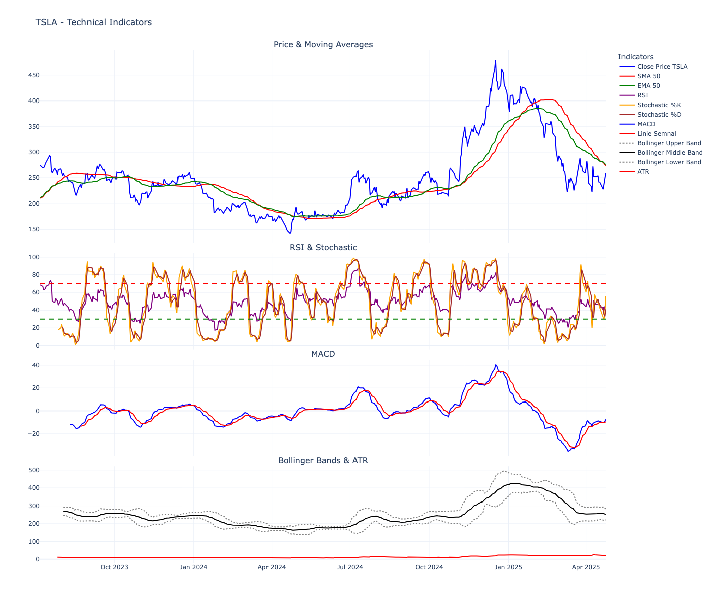
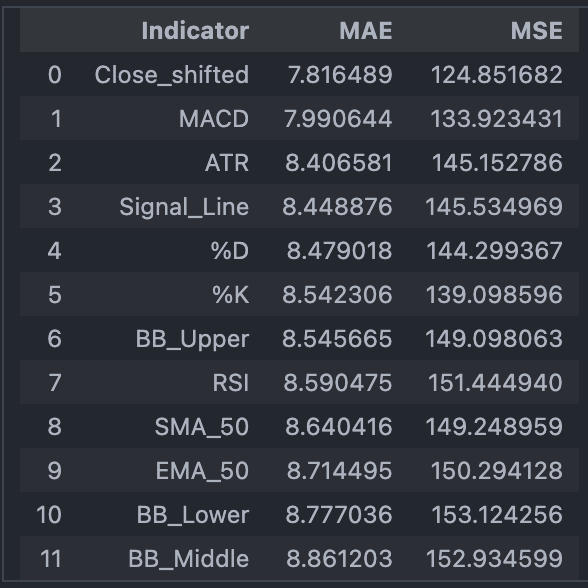
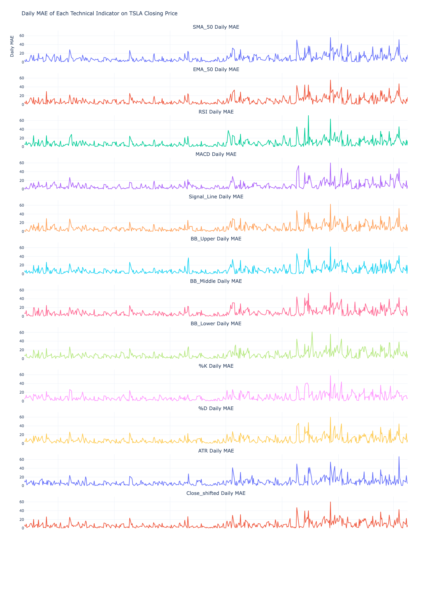

# 📈 Predictive-Power-of-Technical-Indicators TSLA Stock  

*A data science project quantifying the predictive value of technical indicators for algorithmic trading strategies.*

*Technical Indicators*

*Model Performance (MAE/MSE Evaluation)*

*MAE for each indicator over time*

## 🛠️ Technical Implementation
| Component          | Technology Used          |
|--------------------|--------------------------|
| Data Collection    | `yfinance` API           |
| Data Processing    | `pandas`, `numpy`        |
| Feature Engineering| `pandas_ta`              |
| Modeling           | `scikit-learn` Pipeline  |
| Evaluation         | MAE/MSE metrics          |
| Visualization      | `plotly` interactive     |

### AI Implementation Steps:
1. **Data Collection**: Download stock data via `yfinance`.
2. **Data Processing**: Clean and preprocess data using `pandas` and `numpy`.
3. **Feature Engineering**: Compute technical indicators with `pandas_ta`.
4. **Modeling**: Build a linear regression model with `scikit-learn` within a pipeline.
5. **Evaluation**: Use MAE/MSE to evaluate prediction accuracy.
6. **Visualization**: Visualize results with `plotly`.

## 📊 Results Summary
* key observation is that for most indicators, MAE values tend to increase progressively over time.
* The rising MAE trend seen in the previous graph clearly shows how predictions based on indicators become less accurate in the second half of the time period.

